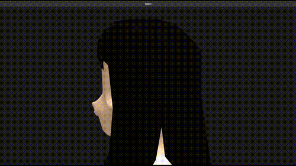

# Only serious programming here 🥷

- GameDev 👾 and Robotics 🤖
- Highly opinionated articles about programming
  - [CMake is all you need](https://medium.com/@us4tiyny4n/cmake-is-all-you-need-f67e8c391591)
  - [Employing Monads and Laziness in C++](https://medium.com/@us4tiyny4n/employing-monads-and-lazyness-in-c-d5aefe2a57a9)
  - more coming ...
- Writeups and design decisions:
  - framework for asynchrony in C++: [serious-execution-library](https://github.com/UsatiyNyan/serious-execution-library/wiki)

